# Panorama Stitching with Depth Matching
 
In this repository, we attempt to solve the problem of automatically stitching several images that are possibly in a panorama.

However, compared to traditional methods of simply computing a single homography matrix between a pair of images, we try to see if it is possible to do stitching given an additional dimension of depth. (RGBD Images)

## Approach

There are 4 major subparts of this task:
- Matching features
    - This has been done using the inbuilt ORB features with BEBLID descriptors.
    - To match features, we use the inbuilt BF matcher that brute forces matches between ORB features between two images using a distance function.
- Finding the homography matrix
    - Since we are provided with the RGBD image pairs, if we are to stitch 2 images (source, reference), then we do the following:
        - Compute feature descriptors between both images. We compute a total of 5000 feature descriptors using ORB.
        - Quantize image 2 into `m` depth levels. Since the depth image ranges from 0 - 255, if we need to split into 5 levels, our ranges of pixels would be 0 - 51, 51 - 102, and so on.
        - For each depth level in the reference image (from the depth maps), compute all the features falling within this depth level.
        - For the subset of features in that depth level, use RANSAC and compute the homography matrix between that particular depth level and the source image
    - We use the RANSAC algorithm with a total of 5000 trials, taking 4 matches at a time to estimate the Homography.
        - The RANSAC method has been vectorized in order to speed up the process.

- Warping images
    - Given a homography, 2 methods of warping have been implemented
        - Forward projection: Here, for each pixel in the source image, we project the pixel onto a warped image. However, this causes holes in the projected image.
        - Inverse sampling: Here, we compute the Inverse homography matrix, and sample pixels for each destination pixel from the source image. This solves the problem of having holes.

    - In order to speed up the process, the transformation has been converted from a O(n^2) loop to a matrix multiplication using the indices.
    - Since we have previously established that there are m depth levels, there are hence m homography matrices for each image pair. We now warp each depth level corresponding to its own homography matrix.

- Blending images
    - We simply overlay the images in order to blend them. Laplacian blending is not possbile since the manner in which the cut has to be executed cannot be handcrafted for each depth level.

## Implementation Specifics 

- Since the ORB feature descriptor is not very robust, we notice that the homography matrix computed is often incorrect. Moreover, we notice that even the inbuilt homography estimator using the ORB descriptor is not very good. We hence attribute this to improper feature descriptors and bad matching.

- Ocasionally, we notice that the warping fails since the warped image doesnt fit within the temporary image buffer. This can be fixed by changing the image size.

## Results

All the results can be viewed in the `outputs/*/*` directory.

Disclaimer: The image has been cropped manually just for the sake of viewing in the Readme.

| Custom Implementation | OpenCV Implementation | Single Homography
| ------------- | ------------- |:-------------:|
| 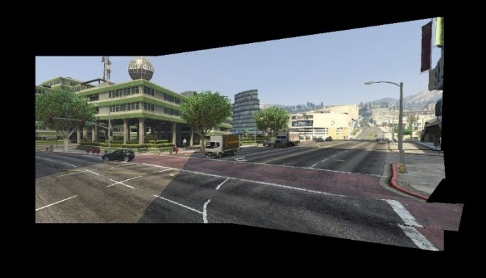|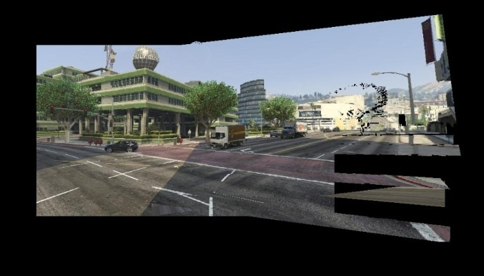 | 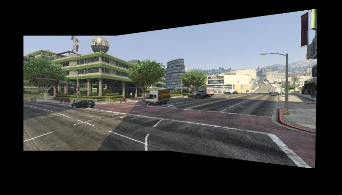
| 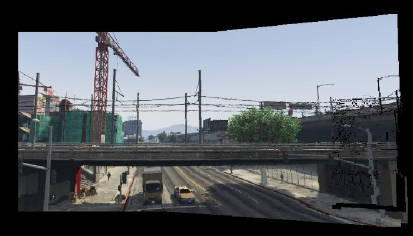|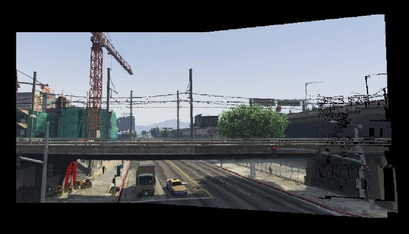 |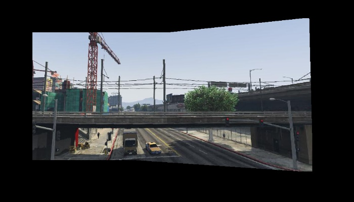 |
| 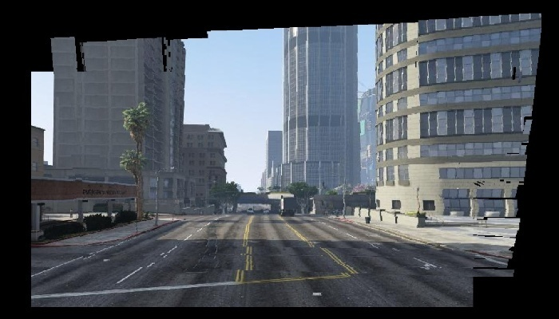|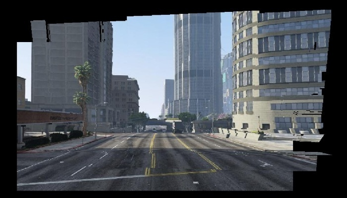 | 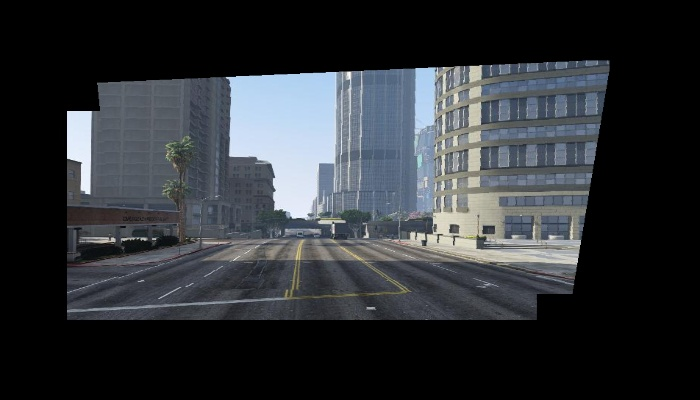

- We can see that both the OpenCV result and custom result are similar. In some cases, we see that the OpenCV estimation is infact worse than the custom implmentation (First image set). This shows that the RANSAC implementation is at par with the inbuilt technique. This is again due to the poor estimation of ORB features. 

- We notice that the depth wise estimation of homography is worse compared to the single homography estimation for an image pair with RGB images. This is because slight errors in homography estimation (due to poor features) can cause large changes in the visual appearance of the image. Hence, for the purpose of panorama stitching, using a single homography matrix is superior than depth wise stitching, since the visual quality is better.

- In this method, we compute the features between both images entirely, and check the features within each depth level. However, if we let the ORB feature descriptor to detect features at defaults, we get roughly 250 features per image pair. When we check the number of features depending on quantization, the number of features per level can go below 4 for several depth levels (for a sufficiently high value of m). This means that a homography cannot be found for these regions.
    - To alleviate this problem, we set the total number of features extracted by the ORB descriptor to 5000. This allows some features to exist in all depth levels. However, the quality of these features are worse, and hence leads to poor homography estimation which is seen in the images.

- Since there are several homographies per image pair, even small errors in feature detection and homography estimation can lead to holes in the warped image. This is hence not a good method to compute a panorama as there are more chances for failure. We can also see that reducing the number of failure points (by reducing the number of depth levels) can improve the stitching of the images. 

- Upon increasing the total number of depth levels, the warping quality goes down. This is because of the low number of features present in each quantized depth level. This also makes intuitive sense, since for a fixed number of total features, the number of features in each depth level will go down if the number of depth levels increases. An example is seen here (5 depth levels), where the final image is very close to the single homography image.
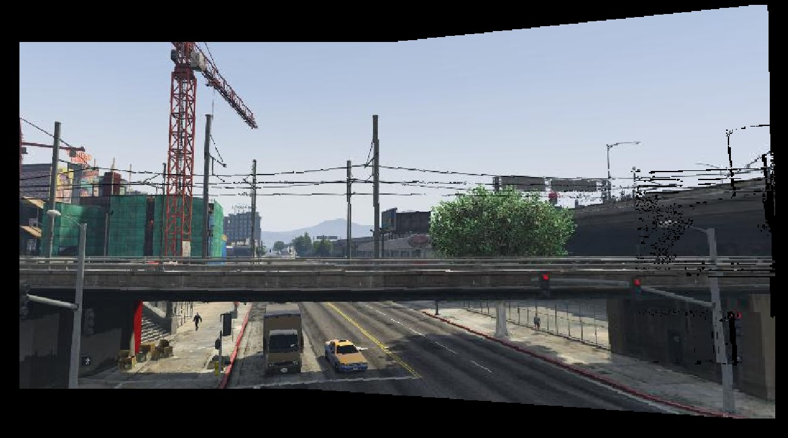

- Empirically, we observe that for very large number of depth levels (m >= 15), the computed homographies are extremely poor, since the warped image fails to generate as it does not fit within the available RAM of the device. An example is shown below:

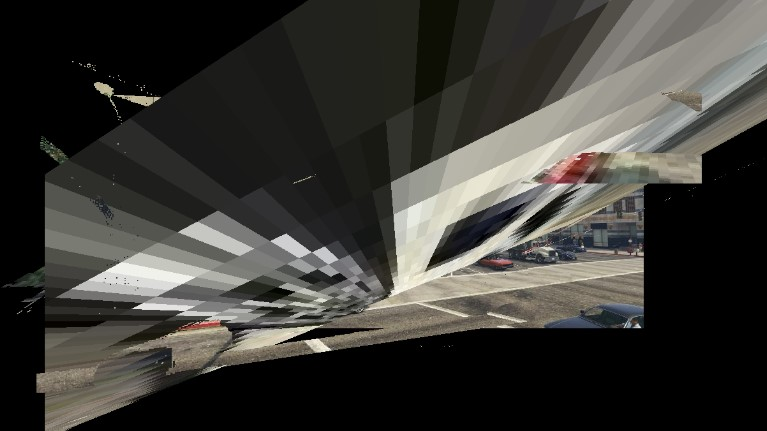

## Usage

This repository implements the following:
- Matching features between two images using OpenCV functions (ORB descriptors) - `main.py`
- Estimating the best homography matrix between the images using RANSAC - `main.py`
- Implementation of laplacian stitching to stitch the images - `blending.py`
- Using inbuilt functions to estimate homography - `opencvBlender.py`

- To run the script, clone the repository, and change the `imageSet` variable in the file to match the set that you want to run it on.
- Run the script from the terminal using `python main.py`

- To get the OpenCV implementation, run `python opencv.py`
